```
🕙 分享是一种美德，右上随手点个 🌟 Star，谢谢
```

**温馨提醒**

1. 本项目仅适用学习交流
2. 本项目不在任何平台出售,如有发现请积极举报<br/>
3. 为了更好的体验，友情提示此项目是一个全栈项目，认真刻苦的掌握它，熟练掌握后你就比较牛掰了<br/>
4. 不要只是白嫖 ,如果帮到你了麻烦**点个Star**<br/>
5. 发现有问题？添加下方微信客服一起探讨，或者直接提Issues

## 1.项目简介

奇羽项目是一款智能软件，提供羽毛球预约、场地预约、后台用户管理、场地管理等多种功能，为用户提供便捷高效的体验。

### 1.1功能概况

1、奇羽项目使用golang gin、gorm技术，提高工作效率和创造力。<br/>
2、奇羽后台项目能够结合小程序和pc端进行场馆管理<br/>

#### 1. 登录

需要微信登录

 


#### 2. 首页

可以进行场地、活动的分类，进行查看

 

#### 3. 预约界面

是进行场馆列表，在列表展示了场馆的头像、名称、价格、具体位置等

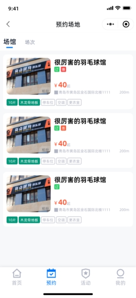 

#### 4. 场馆信息

点击可以查看场馆的详细信息，包含场馆电话、场馆配套设置等，主要是展示了预约的场地预定界面，用户可以进行查看场地的预约概括，点击可以进行详细的场地选择预约。

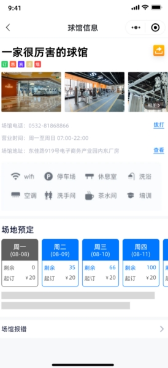 

#### 5.场地预约

该界面展示了该场馆一周内的场地预约详细情况。用户可以选择一天进行场地预约。下面会有列表展示用户选择了哪一些场地。最终会计算总额。

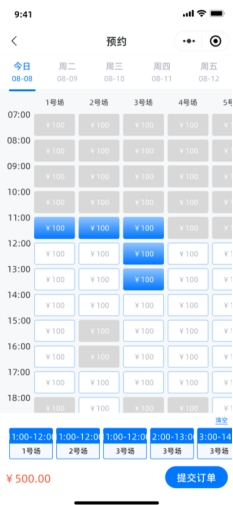 

#### 6.订单详情页面

用户选择完日期、场地后，跳转到结算页面，该页面展示了此订单的详细信息。包含用户选择的场馆信息、选择的场地信息、以及总费用。

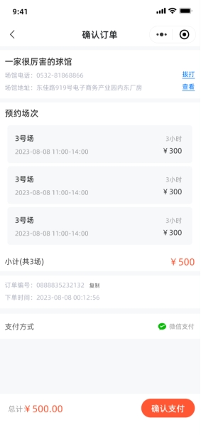 

#### 6.支付成功

会展示支付成功的页面，会提供一个二维码，可让用户进行核销。

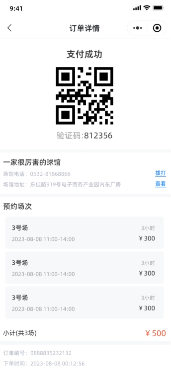 

#### 7.我的

界面内，可以查看该用户的基本信息。包含运动总时长，累计天数等，也可以查看自己的预约。订单等操作。

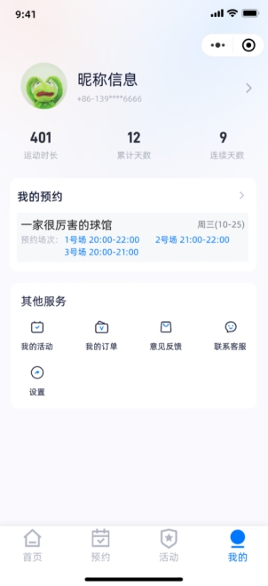 

#### 8. 修改信息页面

用户点击头像，即可进行用户信息的修改

 

#### 9. 订单页面

用户点击‘我的订单’，即可查看自己生成的订单，可进行分类查询，待支付、待使用等。点击可以查看订单的详细信息。

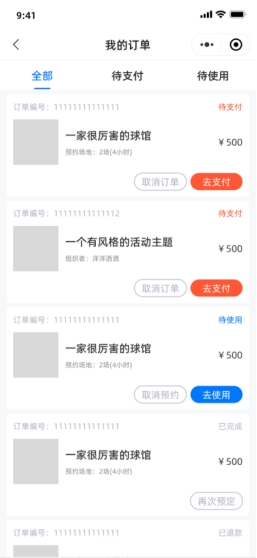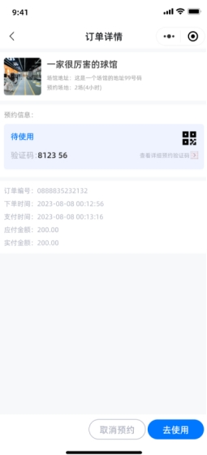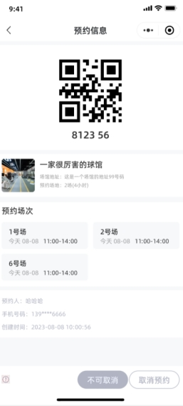 

#### 10. 用户反馈意

用户可以进行意见的反馈

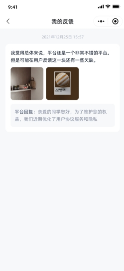 

#### 11. 活动列表界面

用户可以查看该地区所有场馆举办的活动。

 

#### 12.活动详情界面

用户可以在该界面中查看该活动的有关信息。包含场馆的信息，发起人的信息，已经报名人的概括等。同时可以在此界面进行报名。

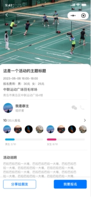 

#### 13.在报名时

系统会根据当前已经报名的人数自动进行判断，用户是要进行报名还是候选。报名可以填写多人名额。如果候选则只能自己一个人进行候选。

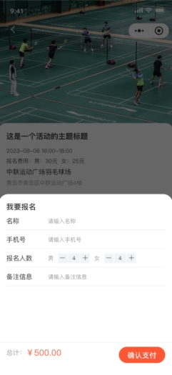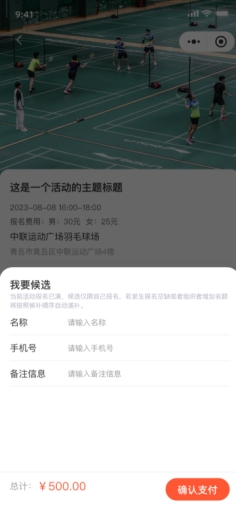 

#### 14. 用户发起活动界面，

用户可以自己进行活动发起，来召集人员进行参加活动，发起活动界面需要填写活动的相关信息，已经场地的信息等。

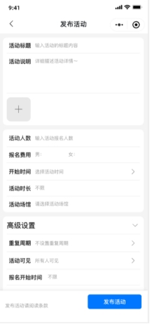 

#### 15. 我的活动列表中

可以查看自己发布活动的状态，以及查自己发布活动的数据

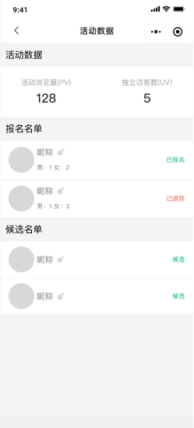


## 2.xxx项目完整运行步骤


### 2.2xxx项目结构

```
controller  //控制器文件
dao //数据库
kit //独立运行工具包
logger //日志包
models //结构体包
util //代码工具包
go.mod 
main.go
```

### 2.3xxx项目后端代码运行步骤

#### 2.3.1环境配置

**运行环境**：golang 1.16+ 

#### 2.3.2 接口入口文件

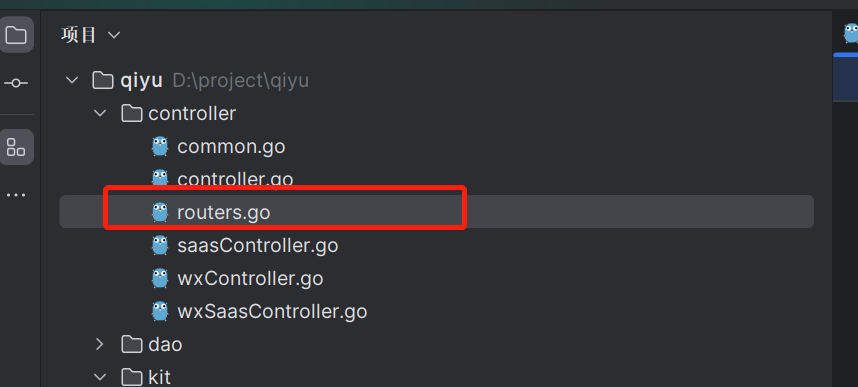

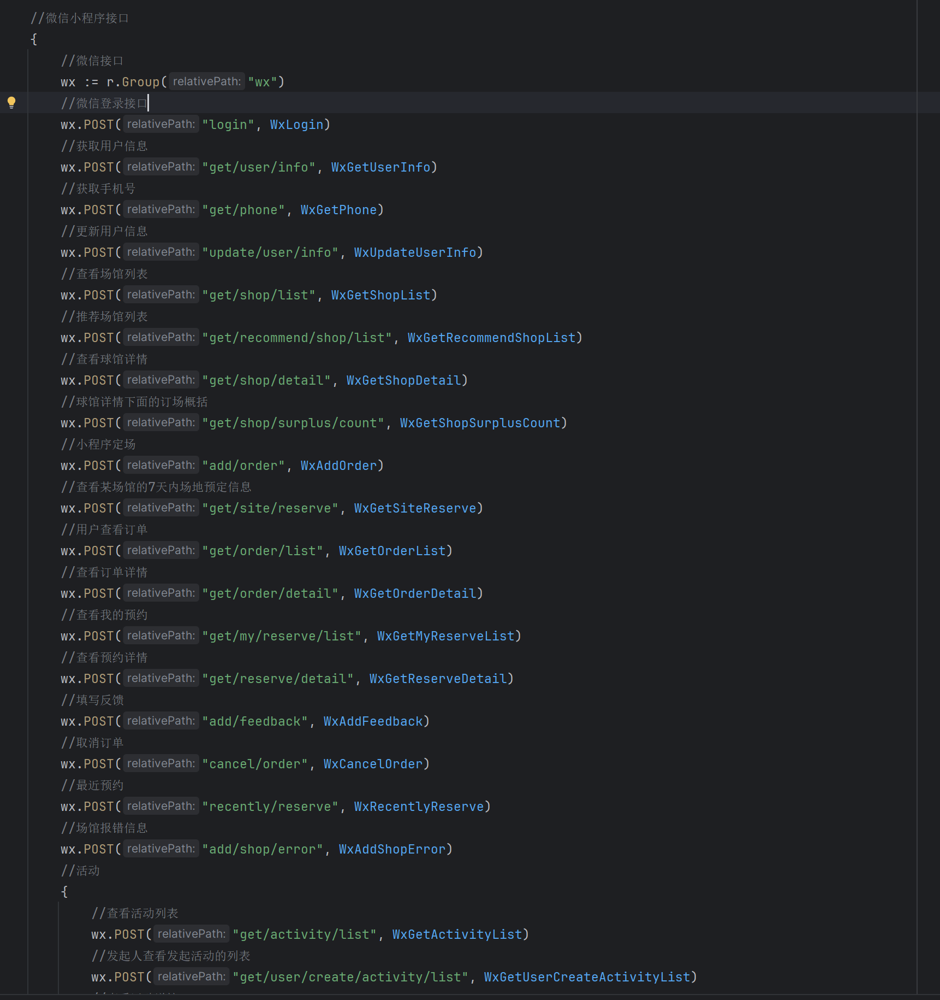